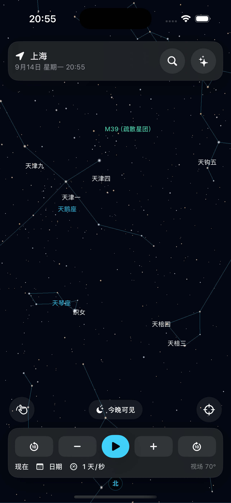
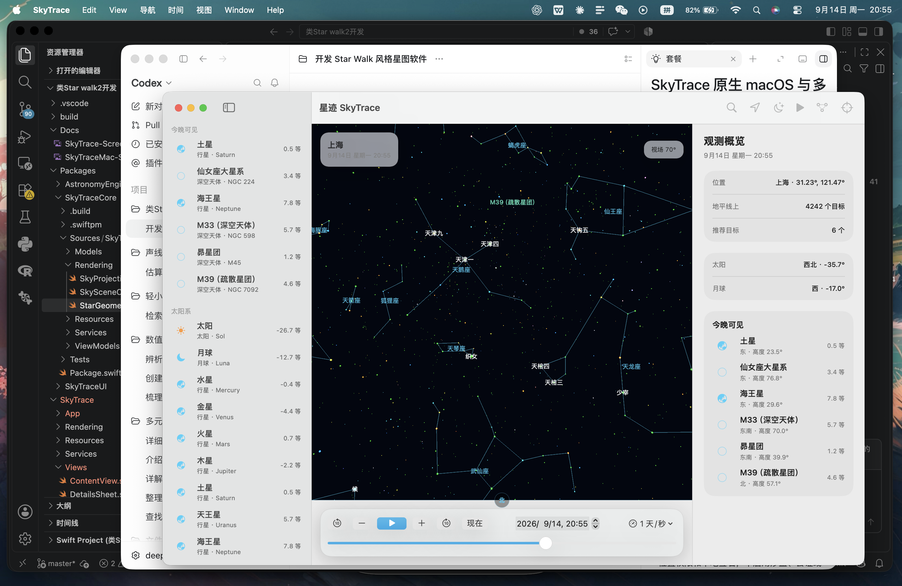

# SkyTrace 星迹

[](https://github.com/LyonZZZZzzzz/SkyTrace/actions/workflows/ci.yml)
[](LICENSE)
[](https://developer.apple.com/ios/)
[](https://www.apple.com/macos/)

SkyTrace 是一个完全离线的原生星图浏览应用，支持 iPhone、iPad 和 Apple Silicon Mac。项目使用 Swift 6、SwiftUI、SceneKit、CoreLocation、CoreMotion 和 Astronomy Engine，提供真实星空、时间旅行、定位、搜索、天体详情与今晚可见推荐。





## 功能

### 通用能力

- 8,404 颗视星等不高于 6.5 的恒星
- 太阳、月球和主要行星的实时位置
- 88 个 IAU 星座与 110 个梅西耶天体
- 1900–2100 时间旅行和播放
- 本机定位、手动坐标和内置城市
- 中文、英文、目录编号和梅西耶编号搜索
- 天体详情、方位、高度和今晚可见推荐
- 完全离线，不需要账号或后端服务

### iOS / iPadOS

- 全屏手势星空
- 拖动、捏合、双指旋转和点击选择
- CoreMotion 设备姿态浏览
- 搜索、位置、详情和推荐 sheet
- 保留移动端优先的信息架构

### macOS

- 原生三栏观测台
- 左侧目录、中央星空、右侧检查器
- 标准窗口、菜单栏和独立设置窗口
- 鼠标、滚轮、触控板缩放/平移/旋转
- 系统浅色/深色外观；星空画布保持深色

## 系统要求

| 平台 | 最低版本 |
| --- | --- |
| iOS / iPadOS | 17 |
| macOS | 14，Apple Silicon |
| Xcode | 16.4 |
| Swift | 6.1 |
| XcodeGen | 2.46 |

## 快速开始

```bash
git clone https://github.com/LyonZZZZzzzz/SkyTrace.git
cd SkyTrace
brew install xcodegen
xcodegen generate
```

macOS 构建与运行：

```bash
xcodebuild \
  -project SkyTrace.xcodeproj \
  -scheme SkyTraceMac \
  -destination 'platform=macOS,arch=arm64' \
  -derivedDataPath build \
  CODE_SIGN_IDENTITY=- \
  build

open build/Build/Products/Debug/SkyTrace.app
```

iOS Simulator：

```bash
xcodebuild \
  -project SkyTrace.xcodeproj \
  -scheme SkyTrace \
  -sdk iphonesimulator \
  -destination 'platform=iOS Simulator,name=iPhone 16 Pro,OS=18.6' \
  CODE_SIGNING_ALLOWED=NO \
  build
```

## 测试

```bash
swift test --package-path Packages/SkyTraceCore
```

```bash
xcodebuild \
  -project SkyTrace.xcodeproj \
  -scheme SkyTraceMac \
  -destination 'platform=macOS,arch=arm64' \
  -derivedDataPath build \
  CODE_SIGN_IDENTITY=- \
  -only-testing:SkyTraceMacTests \
  test
```

```bash
xcodebuild \
  -project SkyTrace.xcodeproj \
  -scheme SkyTrace \
  -sdk iphonesimulator \
  -destination 'platform=iOS Simulator,name=iPhone 16 Pro,OS=18.6' \
  CODE_SIGNING_ALLOWED=NO \
  -only-testing:SkyTraceTests \
  test
```

## 架构

```text
AstronomyEngine
      │
SkyTraceCore ─── SkyTraceUI
      │              │
 ┌────┴────┐    ┌────┴────┐
 │         │    │         │
iOS App   macOS App
```

- `Packages/AstronomyEngine`：MIT 许可的 C 天文计算引擎与 Swift 包装
- `Packages/SkyTraceCore`：模型、目录、位置、计算、ViewModel、投影和 SceneKit 控制器
- `Packages/SkyTraceUI`：共享主题、标签和内容组件
- `SkyTrace`：iOS/iPadOS App
- `SkyTraceMac`：原生 macOS App
- `Tools/generate_catalog.py`：离线目录生成工具

详细设计请阅读 [ARCHITECTURE.md](ARCHITECTURE.md) 和 [开发指南](Docs/DEVELOPMENT_GUIDE.md)。

## 离线数据

- Yale Bright Star Catalogue 5th ed.：8,404 颗肉眼可见恒星
- D3-Celestial：BSD-3-Clause 星座连线
- Messier Catalog：110 个深空天体
- Astronomy Engine：MIT License

第三方来源和许可证详见 [THIRD_PARTY_NOTICES.md](THIRD_PARTY_NOTICES.md)。

## 开发与贡献

- [开发指南](Docs/DEVELOPMENT_GUIDE.md)
- [贡献指南](CONTRIBUTING.md)
- [行为准则](CODE_OF_CONDUCT.md)
- [安全政策](SECURITY.md)
- [变更日志](CHANGELOG.md)

## 许可证

SkyTrace 使用 [MIT License](LICENSE)。

```text
Copyright (c) 2026 LyonZZZZzzzz
```
